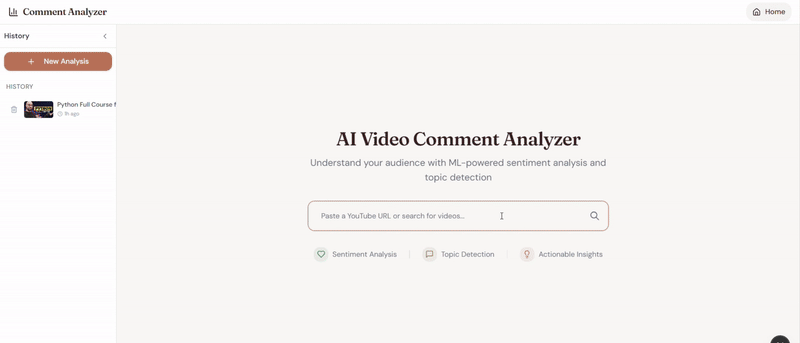
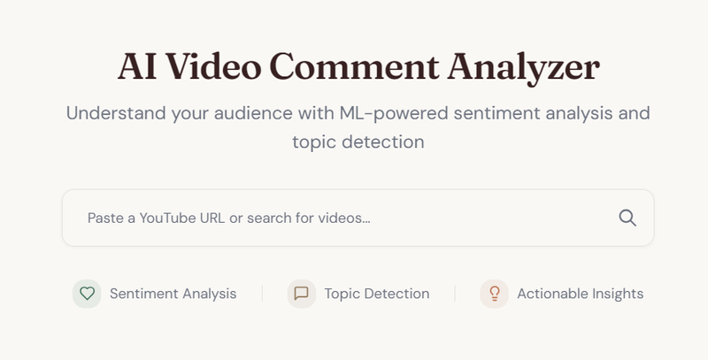
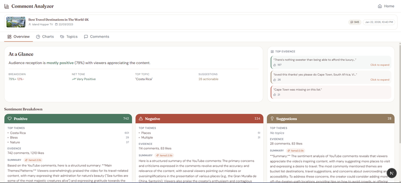
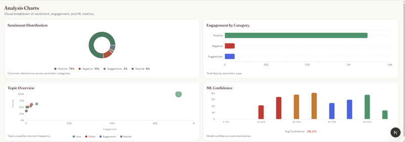
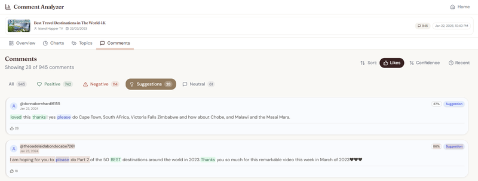

<h1 align="center">AI Video Comment Analyzer</h1>

<p align="center">
  AI-powered YouTube comment analysis with ML sentiment detection, topic modeling, and AI-generated summaries.
</p>

<p align="center">
  
</p>

## Features

- **Comment Extraction**: Fetch up to a configurable comment limit per video using yt-dlp (default 100)
- **Sentiment Analysis**: BERT-powered multilingual sentiment classification (positive/negative/neutral/suggestion)
- **Topic Modeling**: BERTopic clustering to identify key discussion themes
- **AI Summaries**: Local LLM-powered summaries via Ollama (llama3.2:3b)
- **Multi-Page Dashboard**: Dedicated pages for Overview, Charts, Topics, and Comments
- **Real-time Progress**: SSE streaming with ML metrics during analysis

## Screenshots

<details>
<summary>View Screenshots</summary>

### Home


### Overview


### Charts


### Suggestions


</details>

## Quick Start

### Prerequisites

- Node.js 20+
- pnpm
- Python 3.11+
- [uv](https://docs.astral.sh/uv/) (Python package manager)
- [Ollama](https://ollama.ai) (optional, for AI summaries)
- NVIDIA GPU with CUDA (optional, for faster ML inference)

### Frontend Setup

```bash
# Install dependencies
pnpm install

# Run development server
pnpm dev
```

Open [http://localhost:3000](http://localhost:3000) in your browser.

### Backend Setup

```bash
# Install uv (if not already installed)
curl -LsSf https://astral.sh/uv/install.sh | sh

# Install dependencies (includes ML models: torch, transformers, bertopic)
uv sync

# Run API server
uv run uvicorn api.main:app --reload --port 8000
```

API available at [http://localhost:8000](http://localhost:8000)

### Ollama Setup (Optional)

For AI-generated summaries of comment sentiment:

```bash
# Install Ollama
curl -fsSL https://ollama.ai/install.sh | sh

# Pull the model
ollama pull llama3.2:3b

# Start Ollama server (if not running)
ollama serve
```

## Architecture

### Multi-Page Routes

```
/                           - Home (URL input + history sidebar)
/analysis/[id]              - Overview page (At a Glance + Summary Cards)
/analysis/[id]/charts       - Charts page (2x2 grid with context)
/analysis/[id]/topics       - Topics page (list + detail panel)
/analysis/[id]/comments     - Comments page (filters + sorting)
```

### Tech Stack

- **Frontend**: Next.js 15, React 19, TypeScript, Tailwind CSS v4, shadcn/ui, Recharts
- **Backend**: FastAPI, Python 3.11+, yt-dlp, SQLAlchemy
- **Database**: SQLite
- **AI/ML**:
  - `nlptown/bert-base-multilingual-uncased-sentiment` (sentiment)
  - BERTopic with `all-MiniLM-L6-v2` embeddings (topics)
  - Ollama with llama3.2:3b (AI summaries)

### Design System

- **Typography**: Fraunces (display), DM Sans (body), JetBrains Mono (code)
- **Colors**: Navy (#1E3A5F) + Terracotta (#D4714E) accent, warm cream background
- **Sentiment**: Green (positive), Red (negative), Blue (suggestion), Gray (neutral)

## Project Structure

```
src/
├── app/
│   ├── page.tsx                    # Home (input + history)
│   ├── layout.tsx                  # Root layout with fonts
│   ├── globals.css                 # Design system
│   └── analysis/[id]/
│       ├── layout.tsx              # Analysis layout (nav + tabs)
│       ├── page.tsx                # Overview page
│       ├── charts/page.tsx         # Charts page
│       ├── topics/page.tsx         # Topics page
│       └── comments/page.tsx       # Comments page
├── components/
│   ├── navigation/                 # GlobalNav, AnalysisTabs
│   ├── blocks/                     # EvidenceStrip, SummaryCard, SentimentFilter
│   ├── charts/                     # SentimentPie, EngagementBar, etc.
│   └── results/                    # TopicRanking, CommentCard, etc.
├── context/
│   └── analysis-context.tsx        # Shared analysis state
├── hooks/
│   ├── useAnalysis.ts              # Analysis + ML metrics
│   └── useAnalysisData.ts          # Data fetching
└── types/
    └── index.ts                    # TypeScript interfaces

api/
├── main.py                         # FastAPI app
├── config.py                       # Environment config
├── routers/
│   └── analysis.py                 # SSE streaming endpoints
├── services/
│   ├── youtube.py                  # yt-dlp extraction
│   ├── sentiment.py                # BERT sentiment
│   ├── topics.py                   # BERTopic modeling
│   └── summarizer.py               # Ollama summaries
└── db/
    └── models.py                   # SQLAlchemy models
```

## API Endpoints

| Method | Endpoint | Description |
|--------|----------|-------------|
| POST | `/api/analysis/analyze` | Start analysis (SSE stream) |
| GET | `/api/analysis/result/{id}` | Get analysis results |
| GET | `/api/analysis/result/{id}/comments` | Get comments for analysis |
| GET | `/api/analysis/history` | List past analyses |
| DELETE | `/api/analysis/history/{id}` | Delete an analysis |
| GET | `/api/analysis/search` | Search YouTube videos |

## Environment Variables

Copy `.env.example` to `.env` and configure:

```bash
# YouTube
YOUTUBE_MAX_COMMENTS=100

# Ollama (AI Summaries)
OLLAMA_URL=http://localhost:11434
OLLAMA_MODEL=llama3.2:3b
OLLAMA_ENABLED=true

# ML Processing
SENTIMENT_BATCH_SIZE=32
MAX_TOPICS=10
```

## Development

### Running the App

```bash
# Terminal 1 - Frontend
pnpm dev

# Terminal 2 - Backend
uv run uvicorn api.main:app --reload --port 8000

# Terminal 3 - Ollama (optional)
ollama serve
```

### Running Tests

```bash
# Run all tests
uv run pytest tests/ -v

# Run with coverage
uv run pytest tests/ -v --cov=api --cov-report=term-missing
```

### Code Quality

```bash
# Lint
uv run ruff check api/ tests/

# Format
uv run ruff format api/ tests/

# Frontend lint
pnpm lint
```

### CI Pipeline

GitHub Actions runs on every push/PR:
- **Lint**: Ruff check + format verification
- **Test**: pytest with 65% coverage threshold

## License

MIT
